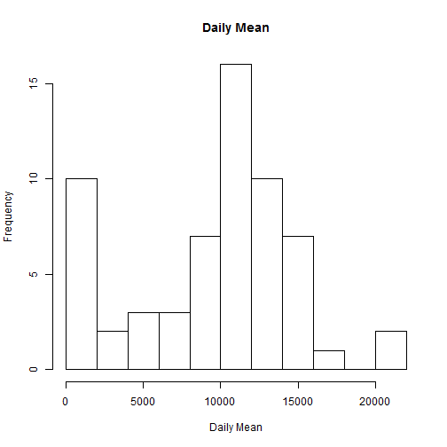
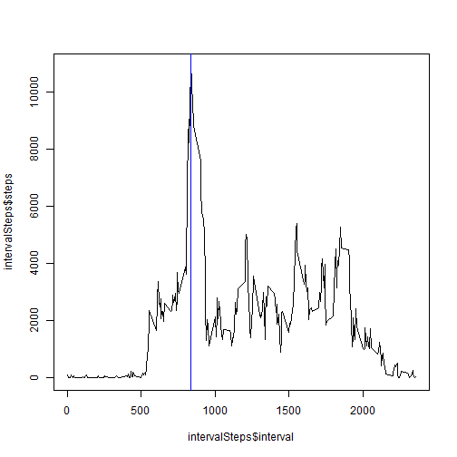
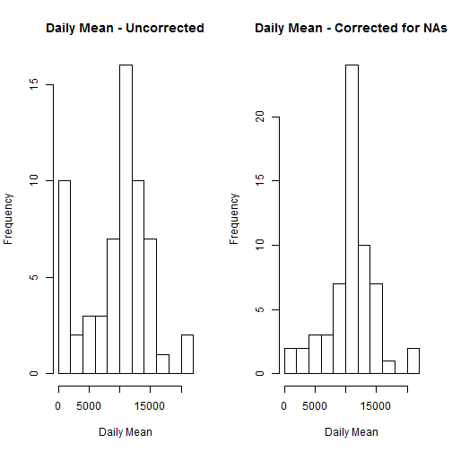
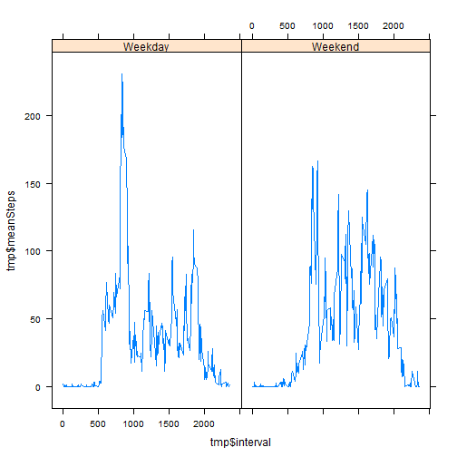

---
## Loading and preprocessing the data

Assuming that your working directory contains the data file "activity'csv"


```r
ds <- read.csv("activity.csv")
summary(ds)
```

```
##      steps                date          interval     
##  Min.   :  0.00   2012-10-01:  288   Min.   :   0.0  
##  1st Qu.:  0.00   2012-10-02:  288   1st Qu.: 588.8  
##  Median :  0.00   2012-10-03:  288   Median :1177.5  
##  Mean   : 37.38   2012-10-04:  288   Mean   :1177.5  
##  3rd Qu.: 12.00   2012-10-05:  288   3rd Qu.:1766.2  
##  Max.   :806.00   2012-10-06:  288   Max.   :2355.0  
##  NA's   :2304     (Other)   :15840
```


## What is mean total number of steps taken per day?

```r
dailyMean <- tapply(ds$steps, ds$date, sum, na.rm=TRUE)
print(paste("The daily mean is ", round(mean(dailyMean), 2)))
```

```
## [1] "The daily mean is  9354.23"
```

```r
print(paste("The daily median is ", round(median(dailyMean), 2)))
```

```
## [1] "The daily median is  10395"
```


```r
hist(dailyMean, main="Daily Mean", xlab="Daily Mean", ylab="Frequency", breaks=10)
```

 


## What is the average daily activity pattern?

```r
library(dplyr)
ds2 <- ds[!is.na(ds$steps),]
intervalSteps <- summarize(group_by(ds2, interval), steps=sum(steps))
plot(intervalSteps$interval, intervalSteps$steps, type="l")
intervalStepsMax <- intervalSteps[intervalSteps$steps == max(intervalSteps$steps), ]
abline(v=intervalStepsMax$interval, col="blue")
```

 

## Imputing missing values

```r
missingSteps <- sum(is.na(ds$steps))
missingDates <- sum(is.na(ds$date))
missingIntervals <- sum(is.na(ds$interval))
missingDays <- tapply(!is.na(ds$steps), ds$date, sum, na.rm=TRUE)
missingDays <- sum(missingDays == 0)
incompleteDays <- sum(missingDays > 0 && missingDays < 288)
```
There are 2304 records where there are missing 'steps' (coded as NA) in the data.  
There are 0 records where there are missing 'dates' values (coded as NA) in the data.  
There are 0 records where there are missing 'interval' values (coded as NA) in the data.  
There are 8 days where there is not a single complete record.  
But there are 1 days where the days is incomplete - i.e. fewer than 288 complete records. 

The presence of missing days may introduce bias into some calculations or summaries of the data.

Replacing the missing steps with the mean for the day is not meaningful as each day with a single missing data record has a complete day of missing data. A more reasonable strategy would be to replace them with the mean for the interval (5 minute period).

dsCeaned will be a new dataset that is equal to the original dataset but with the missing data filled in.


```r
intervalMeanSteps <- summarize(group_by(ds2, interval), meanSteps=mean(steps))
dsCleaned <- merge(ds, intervalMeanSteps)
dsCleaned[is.na(dsCleaned$steps), "steps"] <- dsCleaned[is.na(dsCleaned$steps), "meanSteps"]
```

The following histogram shows the the total number of steps taken each day, both before and after correcting for the NA values


```r
dailyMeanCleaned <- tapply(dsCleaned$steps, dsCleaned$date, sum)
par(mfrow=c(1,2))
hist(dailyMean, main="Daily Mean - Uncorrected", xlab="Daily Mean", ylab="Frequency", breaks=10)
hist(dailyMeanCleaned, main="Daily Mean - Corrected for NAs", xlab="Daily Mean", ylab="Frequency", breaks=10)
```

 

Not only does this remove the anomalous peak at zero, but the rest of the chart resembles a normal distribution, as would have been expected initially.

## Are there differences in activity patterns between weekdays and weekends?

Add a new column indicating if the day is a weekday or not

```r
dsCleaned$dayType <- factor(weekdays(as.Date(dsCleaned[, "date"])) %in% c("Saturday", "Sunday"), labels = c("Weekday", "Weekend"))
```

Make a panel plot containing a time series plot (i.e. type = "l") of the 5-minute interval (x-axis) and the average number of steps taken, averaged across all weekday days or weekend days (y-axis). See the README file in the GitHub repository to see an example of what this plot should look like using simulated data.

```r
library(lattice)
dsCleaned$dayType <- factor(weekdays(as.Date(dsCleaned[, "date"]))  %in% c("Saturday", "Sunday"), labels = c("Weekday", "Weekend"))
tmp <- summarize(group_by(dsCleaned, interval, dayType), meanSteps=mean(steps))
xyplot(tmp$meanSteps ~ tmp$interval | tmp$dayType, layout=c(2,1), type="l")
```

 
